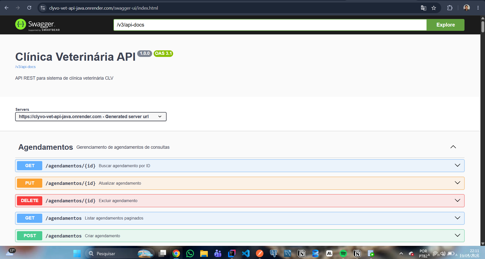
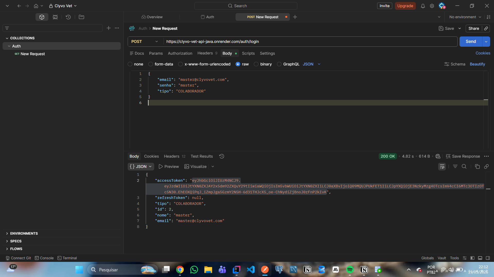
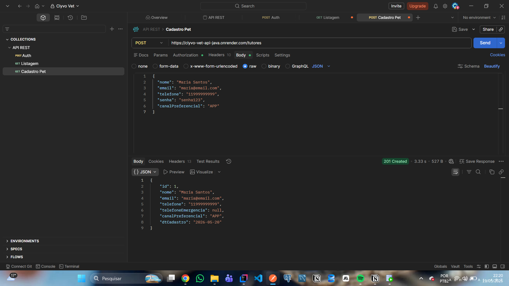
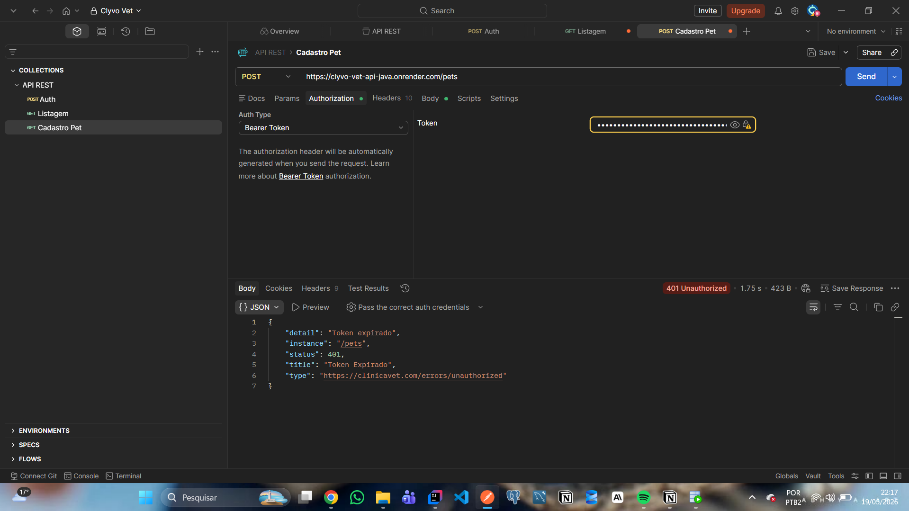

# Clyvo Vet — API Java

API REST de gestão veterinária desenvolvida em Spring Boot 4, com autenticação JWT manual, banco Oracle e suporte a deploy via Docker, Render e Azure VM.

> Projeto acadêmico — FIAP 2TDSR · Challenge 2026

---

## Stack

| Camada | Tecnologia |
|---|---|
| Linguagem | Java 21 |
| Framework | Spring Boot 4.0.6 |
| Banco de dados | Oracle (FIAP) / Oracle XE 21c (local) |
| Autenticação | JWT manual — JJWT 0.12.6 (HS256) |
| Criptografia | BCrypt via spring-security-crypto |
| Documentação | SpringDoc OpenAPI 2.8.9 (Swagger UI) |
| Build | Maven 3.9 (wrapper `mvnw`) |
| Containerização | Docker multi-stage + Docker Compose |

---

## Estrutura de Pacotes

```
br.com.clyvovet.server
├── auth/           # Login, RefreshToken, JwtService, AuthService
├── config/         # AppConfig, AuthInterceptor, WebConfig, DataInitializer
├── exception/      # GlobalExceptionHandler, exceções customizadas
├── converter/      # SimNaoConverter (Boolean ↔ 'S'/'N')
├── enums/          # Todos os enums do domínio
├── colaborador/    # Entidade interna (admin/master)
├── clinica/
├── veterinario/
├── tutor/
├── especie/
├── raca/
├── pet/
├── consulta/
├── agendamento/
├── anamnese/
├── prescricao/
├── medicamento/
├── exame/
├── vacinacao/
├── fichaclinica/   # alergia/, condicao/
├── tipoalergia/
├── tipocondicao/
├── tipovacina/
├── tiposensor/
├── iot/            # sensor/, leitura/, alerta/
└── auditoria/      # LogErro
```

---

## Banco de Dados

25 tabelas Oracle com prefixo `TB_CLV_`. Schema gerenciado manualmente pelo DBA (`ddl-auto=none`).

### Scripts de migração (`docs/migration/`)

| Arquivo | Finalidade | Quando usar |
|---|---|---|
| `V_COMPLETO__create_all_tables.sql` | DDL completo (25 tabelas + FKs + constraints) | Ambiente local — fresh install |
| `V0__foreign_keys.sql` | Apenas FKs via `ALTER TABLE` | Banco FIAP — já tem tabelas, só falta FKs |
| `V1__veterinario_auth_e_refresh_token.sql` | Adiciona `ds_email`/`ds_senha_hash` no VETERINÁRIO + cria `TB_CLV_REFRESH_TOKEN` | Banco FIAP — após V0 |
| `V2__colaborador.sql` | Cria `TB_CLV_COLABORADOR` (usuários internos/admin) | Banco FIAP — após V1 |

**Ordem no banco FIAP:** `V0` → `V1` → `V2` (antes de subir a aplicação pela primeira vez)

### Diagrama de dependências (simplificado)

```
ESPECIE → RACA → PET ← TUTOR
CLINICA → VETERINARIO ↗
PET + VETERINARIO → CONSULTA
CONSULTA → ANAMNESE (1:1)
CONSULTA → PRESCRICAO ← MEDICAMENTO
CONSULTA → EXAME
PET + TIPO_VACINA + VET → APLICACAO_VACINA
PET + TIPO_ALERGIA → ALERGIA_PET
PET + TIPO_CONDICAO → CONDICAO_PET
PET + TIPO_SENSOR → SENSOR_IOT → LEITURA_IOT → ALERTA_IOT
COLABORADOR (sem FKs — usuário interno)
```

---

## Autenticação

### Fluxo

```
POST /auth/login
  Body: { "email": "...", "senha": "...", "tipo": "TUTOR" | "VETERINARIO" | "COLABORADOR" }
  Response: { accessToken, refreshToken, tipo, id, nome, email }

POST /auth/refresh          (não disponível para COLABORADOR)
  Body: { "refreshToken": "..." }
  Response: { accessToken, refreshToken, tipo, id, nome, email }

POST /auth/logout           (não disponível para COLABORADOR)
  Body: { "refreshToken": "..." }
  Response: 204 No Content
```

O `accessToken` expira em **15 minutos**. O `refreshToken` em **7 dias**.

> **Nota COLABORADOR:** sessões do tipo COLABORADOR não geram refresh token (restrição de banco). O `refreshToken` no response será `null`. Para renovar, basta realizar novo login.

### Usuário master (criado automaticamente na inicialização)

| Campo | Valor |
|---|---|
| email | `master@clyvovet.com` |
| senha | `master` |
| tipo | `COLABORADOR` |

### Rotas públicas (sem token)

| Rota | Descrição |
|---|---|
| `POST /auth/login` | Login |
| `POST /auth/refresh` | Renovar token |
| `POST /auth/logout` | Revogar sessão |
| `POST /tutores` | Cadastro de tutor |
| `POST /clinicas` | Cadastro de clínica |
| `POST /veterinarios` | Cadastro de veterinário |
| `GET /swagger-ui.html` | Documentação Swagger |
| `GET /v3/api-docs/**` | OpenAPI spec |

Todas as demais rotas exigem `Authorization: Bearer <accessToken>`.

---

## Rodando Localmente

### Com Docker Compose (recomendado)

Sobe Oracle XE 21c + API automaticamente:

```bash
docker-compose up --build
```

Aguarde o Oracle ficar healthy (~2 min na primeira vez). Depois execute o script DDL:

```
Conecte no Oracle local: jdbc:oracle:thin:@localhost:1521/PETFLOWDB
Usuário: petflow  |  Senha: PetFlow2026
Execute: docs/migration/V_COMPLETO__create_all_tables.sql
```

API disponível em: `http://localhost:8080`
Swagger: `http://localhost:8080/swagger-ui.html`

### Sem Docker (banco FIAP)

1. Configure as variáveis de ambiente (ver tabela abaixo)
2. Execute as migrations no banco FIAP na ordem: `V0` → `V1` → `V2`
3. Rode com o Maven wrapper:

```bash
./mvnw spring-boot:run        # Linux/macOS
.\mvnw.cmd spring-boot:run    # Windows
```

---

## Variáveis de Ambiente

| Variável | Descrição | Default |
|---|---|---|
| `SPRING_DATASOURCE_URL` | URL JDBC do Oracle | — (obrigatória) |
| `SPRING_DATASOURCE_USERNAME` | Usuário Oracle | — (obrigatória) |
| `SPRING_DATASOURCE_PASSWORD` | Senha Oracle | — (obrigatória) |
| `APP_JWT_SECRET` | Secret HS256 (mín. 32 chars) | — (obrigatória) |
| `PORT` | Porta HTTP | `8080` |
| `SPRING_JPA_HIBERNATE_DDL_AUTO` | DDL auto | `none` |

**Exemplo para banco FIAP:**
```
SPRING_DATASOURCE_URL=jdbc:oracle:thin:@oracle.fiap.com.br:1521:ORCL
SPRING_DATASOURCE_USERNAME=rm563558
SPRING_DATASOURCE_PASSWORD=<sua_senha>
APP_JWT_SECRET=<secret_com_minimo_32_caracteres>
```

---

## Fluxo de Teste Manual

Sequência recomendada para validar todos os domínios da API. Use o Swagger em `/swagger-ui.html` ou um cliente REST (Postman/Insomnia).

### 1. Login como COLABORADOR (master)

```http
POST /auth/login
{
  "email": "master@clyvovet.com",
  "senha": "master",
  "tipo": "COLABORADOR"
}
```
Guarde o `accessToken` retornado. Use em todas as requisições como:
`Authorization: Bearer <accessToken>`

### 2. Cadastrar dados de lookup

```http
POST /especies    { "nome": "Cão", "descricao": "Canis lupus familiaris" }
POST /racas       { "nome": "Labrador", "especieId": 1 }
POST /tipovacinas { "nome": "V10", "fabricante": "MSD", "doseIntervaloDias": 365 }
POST /tiposensores { "nome": "Temperatura", "unidade": "°C", "valorMin": 37.5, "valorMax": 39.5 }
POST /tipocondicoes { "nome": "Diabetes", "categoria": "Metabólica" }
POST /tipoalergias  { "nome": "Dipirona", "categoria": "MEDICAMENTO" }
POST /medicamentos  { "nome": "Amoxicilina", "principioAtivo": "Amoxicilina", "classeTerapeutica": "Antibiótico" }
```

### 3. Cadastrar clínica e veterinário (rotas públicas)

```http
POST /clinicas
{
  "nome": "Clínica Clyvo",
  "cnpj": "12345678000190",
  "logradouro": "Rua das Flores, 100",
  "cidade": "São Paulo",
  "estado": "SP"
}

POST /veterinarios
{
  "nome": "Dr. João Silva",
  "crmv": "SP-12345",
  "especialidade": "Clínica Geral",
  "email": "joao@clyvo.com",
  "senha": "senha123",
  "clinicaId": 1
}
```

### 4. Cadastrar tutor e pet (tutor é rota pública)

```http
POST /tutores
{
  "nome": "Maria Santos",
  "email": "maria@email.com",
  "telefone": "11999999999",
  "senha": "senha123",
  "canalPreferencial": "APP"
}

POST /pets       (requer token)
{
  "nome": "Rex",
  "dtNascimento": "2020-01-15",
  "sexo": "M",
  "porte": "GRANDE",
  "castrado": true,
  "tutorId": 1,
  "racaId": 1
}
```

### 5. Login como VETERINÁRIO e criar consulta

```http
POST /auth/login
{
  "email": "joao@clyvo.com",
  "senha": "senha123",
  "tipo": "VETERINARIO"
}

POST /consultas
{
  "dtConsulta": "2026-05-19",
  "motivo": "Check-up anual",
  "petId": 1,
  "veterinarioId": 1
}
```

### 6. Testar proteção de rotas (deve retornar 401)

```http
GET /pets           (sem Authorization header)
→ Esperado: 401 Unauthorized
```

### 7. Verificar ficha técnica do pet

```http
GET /pets/1/ficha-tecnica    (com token)
GET /pets/1/consultas
GET /pets/1/vacinas
GET /pets/1/alergias
GET /pets/1/condicoes
```

---

## Deploy

### Render (produção)

**API em produção:** `https://clyvo-vet-api-java.onrender.com`
> Substitua pelo link gerado no dashboard da Render após o primeiro deploy.

**Swagger em produção:** `https://clyvo-vet-api-java.onrender.com/swagger-ui.html`

#### Configuração inicial

1. Conecte o repositório no [render.com](https://render.com)
2. Crie um novo serviço do tipo **Web Service**
3. Selecione **Docker** como runtime (Render detecta o `Dockerfile` automaticamente)
4. Branch de deploy: `main`
5. Configure as variáveis de ambiente no dashboard:

| Variável | Valor |
|---|---|
| `SPRING_DATASOURCE_URL` | `jdbc:oracle:thin:@oracle.fiap.com.br:1521:ORCL` |
| `SPRING_DATASOURCE_USERNAME` | `rm563558` |
| `SPRING_DATASOURCE_PASSWORD` | sua senha Oracle |
| `APP_JWT_SECRET` | string aleatória com mínimo 32 caracteres |

> A variável `PORT` **não precisa ser configurada** — a Render injeta automaticamente.

#### Observações

- O primeiro deploy demora ~5 min (build da imagem Docker)
- A Render faz novo deploy automaticamente a cada push na `main`
- Plano gratuito hiberna após 15 min de inatividade — a primeira requisição pode demorar ~30 s para "acordar" o serviço

### Azure VM

```bash
git clone https://github.com/olavoneves/clyvo-vet_api-java.git
cd clyvo-vet_api-java/server
docker-compose up -d --build
```

---

## Git Flow

```
main      ← produção (nunca commitar direto)
release   ← homologação / testes
develop   ← desenvolvimento
```

**Convenção de commits:** `feature:` · `fix:` · `refactor:` · `docs:` · `test:` · `chore:`

---

## Screenshots

### Swagger UI



### Login — POST /auth/login



### Exemplo de listagem paginada



### Exemplo de erro (401 Unauthorized)



---

## Documentação completa

Acesse o Swagger após subir a aplicação:

```
http://localhost:8080/swagger-ui.html
```
