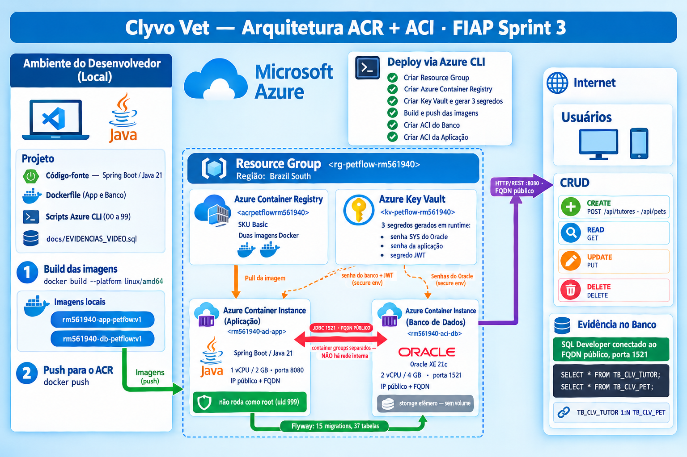
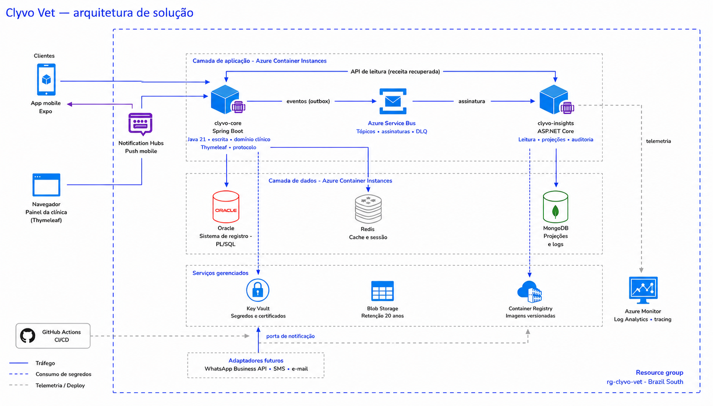

# 🐾 PetFlow — Clyvo Vet API Java

**Infraestrutura do futuro da medicina veterinária digital**

Plataforma de saúde animal que transforma a jornada do pet de um modelo episódico e reativo para uma experiência contínua, preventiva, inteligente e integrada. Desenvolvida como parte do Challenge Clyvo Vet — FIAP 2025/2026.

> Projeto acadêmico — FIAP 2TDSR · Challenge 2026

---

## 📋 Índice

- [Descrição do Projeto](#-descrição-do-projeto)
- [Instalação e Execução](#-instalação-e-execução)
- [Acesso](#-acesso)
- [Autenticação](#-autenticação)
- [Rotas da API](#-rotas-da-api)
- [Stack](#-stack)
- [Estrutura de Pacotes](#-estrutura-de-pacotes)
- [Banco de Dados](#-banco-de-dados)
- [Painel — Receita Recuperada e Coorte](#-painel--receita-recuperada-e-coorte)
- [Lembrete Automático](#-lembrete-automático)
- [Agente de Agendamento](#-agente-de-agendamento)
- [Mapa dos Requisitos](#-mapa-dos-requisitos)
- [Decisões de Arquitetura](#-decisões-de-arquitetura)
- [Uso de IA no Desenvolvimento](#-uso-de-ia-no-desenvolvimento)
- [Deploy — Render](#-deploy--render)
- [Git Flow](#-git-flow)
- [DevOps Tools & Cloud Computing](#️-devops-tools--cloud-computing)
- [Arquitetura de Destino — Sprint 4](#-arquitetura-de-destino--o-desenho-da-sprint-4)
- [Equipe](#-equipe)

---

## 📖 Descrição do Projeto

O **PetFlow** é uma API REST em **Java 21** com **Spring Boot 4.0.6**, sobre um banco
**Oracle XE 21c**, conteinerizada com Docker e provisionada na **Microsoft Azure** por
scripts de Azure CLI.

A plataforma conecta tutores de pets, clínicas veterinárias e o ecossistema de saúde
animal:

- Cadastro de pets, tutores, clínicas e veterinários
- Agendamento de consultas e registro de anamneses
- Controle de vacinação e prescrições médicas
- Monitoramento via sensores IoT com alertas
- Autenticação JWT (access token 15 min + refresh token 7 dias) e multi-tenancy por clínica
- **Motor de protocolo em PL/SQL**: registrar uma consulta materializa as obrigações
  futuras de cuidado, com máquina de estados, auditoria encadeada e outbox
- **Lembrete automático**: um job diário persegue a obrigação e leva o aviso ao tutor
- **Agente de agendamento conversacional**, que fecha o ciclo do lembrete até a consulta
- **Painel de receita recuperada**, com grupo de controle para separar o que o produto
  causou do que teria acontecido de qualquer jeito
- Documentação interativa via Swagger

---

## 💻 Instalação e Execução

### Pré-requisitos

| Ferramenta | Versão | Necessária para |
|---|---|---|
| **Docker Desktop** | 24+ (com Compose v2) | Caminho recomendado — sobe Oracle e API juntos |
| **JDK** | **21** | Compilar e rodar sem Docker; o `pom.xml` fixa `<java.version>21` |
| **Maven** | não precisa instalar | O wrapper `mvnw` / `mvnw.cmd` baixa a versão certa |
| **Oracle** | XE 21c ou o da FIAP | O container já traz o XE; sem Docker, aponte para o seu |
| **Git** | qualquer | Clonar o repositório |

Não é preciso instalar Flyway: ele roda dentro da aplicação, no arranque.

### 1. Clonar e criar o `.env`

```bash
git clone https://github.com/olavoneves/clyvo-vet_api-java.git
cd clyvo-vet_api-java
cp .env.example .env
```

O `.env` está no `.gitignore` e **nunca** deve ser versionado; o `.env.example` existe
para documentar quais segredos são necessários sem carregar nenhum.

### 2. Variáveis de ambiente

| Variável | Descrição | Default | Obrigatória |
|---|---|---|---|
| `SPRING_DATASOURCE_URL` | URL JDBC do Oracle | — | **Sim** |
| `SPRING_DATASOURCE_USERNAME` | Usuário Oracle | — | **Sim** |
| `SPRING_DATASOURCE_PASSWORD` | Senha do usuário Oracle | — | **Sim** |
| `JWT_SECRET` | Secret HS256, mínimo 32 bytes (`openssl rand -base64 48`) | — | **Sim** |
| `GEMINI_API_KEY` | Chave do Google Gemini — **o provedor de LLM ativo** do agente. Gere em [aistudio.google.com/apikey](https://aistudio.google.com/apikey) | vazio | Não: sem ela a aplicação sobe e só `/api/agente/**` responde `503` |
| `ANTHROPIC_API_KEY` | Chave da Anthropic, usada apenas se `app.agente.provedor=anthropic` | vazio | Não |
| `CORS_ALLOWED_ORIGINS` | Origens autorizadas a chamar `/api` de um navegador, separadas por vírgula. Nunca `*` | vazio (nenhuma) | Não |
| `PORT` | Porta HTTP | `8080` | Não |
| `SPRING_JPA_HIBERNATE_DDL_AUTO` | DDL auto | `none` | Não |
| `ORACLE_PASSWORD` | Senha do `SYS`/`SYSTEM` do Oracle **do container** | — | Só no `docker compose` |
| `APP_USER_PASSWORD` | Senha do usuário `petflow`, criado pelo entrypoint da imagem | — | Só no `docker compose` |

> No caminho do `docker compose`, as duas últimas são lidas pelo container do banco e o
> compose reaproveita `APP_USER_PASSWORD` em `SPRING_DATASOURCE_PASSWORD` — não é preciso
> preencher `SPRING_DATASOURCE_*` ali. Sem `ORACLE_PASSWORD`, `APP_USER_PASSWORD` e
> `JWT_SECRET` no `.env`, o `docker compose up` para antes de subir qualquer container.

> ⚠️ **Nunca commite credenciais reais.**
>
> 📌 A variável do JWT chamava-se `APP_JWT_SECRET` até a fase de hardening. Se você tem um
> `.env` ou um ambiente de deploy antigo, **renomeie para `JWT_SECRET`** — a aplicação não
> sobe sem ela.

### 3. Conexão com o Oracle

A aplicação lê a conexão de três variáveis e nada mais; não há `application-*.properties`
por ambiente.

| Caminho | `SPRING_DATASOURCE_URL` |
|---|---|
| Docker Compose | `jdbc:oracle:thin:@oracle-db:1521/PETFLOWDB` (o compose já define) |
| Oracle local fora do compose | `jdbc:oracle:thin:@localhost:1521/PETFLOWDB` |
| Oracle da FIAP | `jdbc:oracle:thin:@oracle.fiap.com.br:1521:ORCL` |

O pool é Hikari com teto de 10 conexões, porque o Oracle da FIAP é compartilhado e tem
cota de sessões por usuário.

### 4. Migrations

**Não há passo manual de migration.** O Flyway roda dentro da aplicação, no arranque,
sobre `src/main/resources/db/migration/`. O Hibernate nunca toca no schema:
`spring.jpa.hibernate.ddl-auto=validate` faz a aplicação **recusar subir** se o mapeamento
divergir do banco.

| Banco | O que acontece no primeiro boot |
|---|---|
| **Vazio** (container do compose) | A cadeia `V0 → V0.1 → V1 … → V14` roda inteira: tabelas, foreign keys, índices, o motor de protocolo em PL/SQL e as views do painel |
| **FIAP** | O schema até a V8 já existia, aplicado pelo DBA. Com `baseline-version=8` o Flyway registra o baseline e aplica a partir da **V9** |

### 5. Subir a aplicação

**Com Docker Compose (recomendado)** — sobe Oracle e API juntos:

```bash
docker compose up --build
```

Aguarde o Oracle ficar healthy (~2 min; o healthcheck tem `start_period` de 120s). A API
sobe em seguida, aplica as migrations e fica disponível.

**Sem Docker**, apontando para um Oracle já existente (o da FIAP, por exemplo):

```bash
./mvnw spring-boot:run        # Linux/macOS
.\mvnw.cmd spring-boot:run    # Windows
```

### 6. Popular a base de demonstração

O banco sobe com o schema criado e **sem dados**. Para semear clínicas, pets, consultas e
os 18 meses de histórico que o painel lê, conecte-se ao Oracle e rode:

```sql
BEGIN PR_CLV_SEED_EXECUTAR(p_qtd_pets => 400); END;
/
```

A procedure vem da migration `V8` e não é chamada por nenhum ponto da aplicação — semear é
ato deliberado.

### 7. Rodar os testes

A suíte tem **160 testes** em 19 classes e passa inteira, **sem nenhum pulado**. Os testes
de integração exigem um Oracle alcançável pelas variáveis de ambiente.

```bash
# com o Oracle do docker-compose de pé
export SPRING_DATASOURCE_URL='jdbc:oracle:thin:@localhost:1521/PETFLOWDB'
export SPRING_DATASOURCE_USERNAME=petflow
export SPRING_DATASOURCE_PASSWORD="$APP_USER_PASSWORD"   # a mesma do .env
export JWT_SECRET='qualquer-segredo-com-mais-de-32-caracteres!!'

./mvnw test                                    # tudo
./mvnw test -Dtest='Agente*,Guardrail*'        # só o agente
./mvnw test -Dtest='*IntegracaoTest'           # só o que toca o banco
```

Nenhum teste chama a API do provedor de LLM: o diálogo roda contra um stub HTTP
(`MockRestServiceServer`), então a suíte não gasta cota nem exige chave.

> **Teste pulado conta como falha aqui.** Os testes de integração fabricam o próprio
> cenário — clínica, tutor, veterinário, pet e obrigação — dentro da transação, que é
> desfeita ao final (`CenarioClinico`, em `src/test/.../support/`). Nenhum deles depende
> de o banco já ter o dado certo, e por isso nenhum se pula em silêncio.

---

## 🔑 Acesso

### URLs locais

| O quê | URL |
|---|---|
| API | `http://localhost:8080/api` |
| Telas (login) | `http://localhost:8080/login` |
| Swagger UI | `http://localhost:8080/swagger-ui.html` |
| OpenAPI JSON | `http://localhost:8080/v3/api-docs` |
| Health check | `http://localhost:8080/actuator/health` |

### Logins de demonstração

Ninguém "cria" esses usuários: eles nascem do seed do passo 6, todos com a senha
**`Clyvo@2026`**. Não são credenciais de produção.

| Perfil | E-mail | Clínica | Cai em | Enxerga |
|---|---|---|---|---|
| Colaborador | `patricia@vidaanimal.com.br` | Vida Animal | `/painel/receita` | Painel, agenda e pets da **sua** clínica; pode antecipar lembrete |
| Colaborador | `diego@petcare.com.br` | PetCare | `/painel/receita` | O mesmo, com os dados da PetCare — serve para ver o isolamento entre clínicas |
| Veterinário | `helena@vidaanimal.com.br` | Vida Animal | `/painel/receita` | As mesmas telas de gestão do colaborador |
| Tutor (Thor) | `camila.ferreira@exemplo.com` | Vida Animal | `/tutor` | Só os próprios pets, a caixa de lembretes e a conversa com o agente |
| Tutor (Nala) | `roberto.almeida@exemplo.com` | Vida Animal | `/tutor` | O mesmo, para o outro pet |

Existe também um **usuário master**, criado pela aplicação no arranque e independente do
seed: `master@clyvovet.com` / `master`, do tipo `COLABORADOR`. É ele que permite criar o
primeiro veterinário de uma instalação nova.

Nenhum tutor alcança as telas de gestão, e nenhum membro da equipe alcança `/tutor/**` —
a separação está em `SecurityConfig` e o mapa completo de rota por perfil está em
[Mapa dos Requisitos](#-mapa-dos-requisitos). **Entrar com `diego@petcare.com.br` é a
forma mais rápida de ver o multi-tenancy funcionando:** os números do painel mudam
inteiros, porque ele é de outra clínica.

> Base semeada antes de 2026-09-04 carrega o hash quebrado da V8 antiga — a **V10**
> corrige as linhas, basta subir a aplicação. Se o login falhar num banco **resemeado**
> depois disso, o problema é outro e está em
> [Repair de objeto PL/SQL](#repair-de-objeto-plsql-exige-um-segundo-passo).

### Roteiro da demonstração

A cadeia inteira, sem passo manual no meio. O fluxo atravessa duas telas e dois logins —
use uma janela anônima para a segunda sessão, senão uma derruba a outra.

1. **Helena** (veterinária) registra a consulta → o **motor de protocolo** materializa as
   obrigações futuras de cuidado daquele pet
2. A **varredura diária** encontra a obrigação cuja janela de antecedência abriu e a leva
   a `NOTIFICADA` — e a transição faz nascer o lembrete
3. **Camila** (tutora) abre `/tutor/caixa`, vê o lembrete, e daí vai para `/tutor/pets/{id}`
4. Escreve pedindo horário → o **agente** consulta a agenda real, propõe, ela escolhe e
   confirma
5. De volta como Helena, o agendamento aparece na **agenda** (`/agenda`), com a obrigação
   atrás
6. O **painel de receita recuperada** (`/painel/receita`) sobe, e o card de coorte mostra
   quanto disso o produto causou

> Para apresentar sem esperar o cron das 8h, use o botão **Antecipar lembrete** na ficha
> do pet — ele faz exatamente a mesma transição que o job faria. Ele não aparece para pet
> do grupo de controle, o que também é parte do que há para mostrar.

---

## 🔐 Autenticação

### Fluxo

```
POST /api/auth/login
  Body: { "email": "...", "senha": "...", "tipo": "TUTOR" | "VETERINARIO" | "COLABORADOR" }
  Response: { accessToken, refreshToken, tipo, id, nome, email }

POST /api/auth/refresh          (não disponível para COLABORADOR)
  Body: { "refreshToken": "..." }
  Response: { accessToken, refreshToken, tipo, id, nome, email }

POST /api/auth/logout           (não disponível para COLABORADOR)
  Body: { "refreshToken": "..." }
  Response: 204 No Content
```

O `accessToken` expira em **15 minutos**. O `refreshToken` em **7 dias**.

### Rotas públicas (sem token)

Esta lista é exaustiva, e é o `SecurityConfig` que a mantém exaustiva: a cadeia da API
termina em `denyAll()`, então rota que ninguém declarou é negada — não há como uma rota
nova virar pública por esquecimento.

| Rota | Descrição |
|---|---|
| `POST /api/auth/**` | Login, refresh e logout |
| `POST /api/clinicas` | Autocadastro de clínica na plataforma |
| `POST /api/tutores` | Autocadastro de tutor, com `clinicaId` no corpo |
| `GET /api/clinicas/publicas` | Vitrine de clínicas — a única leitura aberta da API, numa projeção reduzida (`ClinicaPublicaResponse`). Existe porque o autocadastro de tutor exige `clinicaId` e o aplicativo não teria como descobri-lo antes de ter conta |
| `GET /swagger-ui/**`, `GET /v3/api-docs/**` | Documentação da API |
| `GET /actuator/health` | Health check do container |
| `GET /login` + estáticos | Tela de login e CSS/JS das páginas |

> **`POST /api/veterinarios` não é público.** Exige `ROLE_COLABORADOR` e a clínica sai do
> token, não do corpo. Aberto, seria bypass completo do multi-tenant: qualquer pessoa
> criaria um veterinário numa clínica alheia, autenticaria com ele e leria todos os dados
> daquela clínica.

Todas as demais rotas exigem `Authorization: Bearer <accessToken>` (API) ou sessão
autenticada (telas).

---

## 🔀 Rotas da API

As rotas REST vivem sob `/api`. O prefixo não está escrito nos controllers: é aplicado no
handler mapping (`WebMvcConfig`), para que as telas Thymeleaf possam ocupar `/pets`,
`/agenda` e `/painel/receita` sem colidir com a API.

### API de gestão da clínica (`VETERINARIO` e `COLABORADOR`)

Um token de tutor recebe **403** em qualquer rota desta tabela. O aplicativo do tutor fala
com `/api/tutor/**`, logo abaixo.

| Método | Rota | Descrição |
|---|---|---|
| `GET` | `/api/especies` | Listar espécies (paginado) |
| `GET` | `/api/especies/{id}` | Buscar espécie por ID |
| `POST` | `/api/especies` | Criar espécie |
| `PUT` | `/api/especies/{id}` | Atualizar espécie |
| `DELETE` | `/api/especies/{id}` | Remover espécie |
| `GET` | `/api/racas` | Listar raças |
| `GET` | `/api/pets` | Listar pets |
| `GET` | `/api/pets/{id}/ficha-tecnica` | Ficha técnica completa do pet |
| `GET` | `/api/consultas` | Listar consultas |
| `GET` | `/api/agendamentos` | Listar agendamentos |
| `GET` | `/api/obrigacoes` | Obrigações de cuidado do motor de protocolo |
| `GET` | `/api/painel/receita` | Funil, receita recuperada e coorte |
| `GET` | `/api/veterinarios` | Listar veterinários |
| `GET` | `/api/tutores` | Listar tutores |
| `GET` | `/api/clinicas` | Listar clínicas |
| `GET` | `/api/tipos-vacina` | Listar tipos de vacina |
| `GET` | `/api/vacinas` | Listar aplicações de vacina |
| `GET` | `/api/exames` | Listar exames |
| `GET` | `/api/prescricoes` | Listar prescrições |
| `GET` | `/api/sensores-iot` | Listar sensores IoT |
| `GET` | `/api/leituras-iot` | Listar leituras IoT |
| `GET` | `/api/alertas-iot` | Listar alertas IoT |

Cada família de cadastro tem o CRUD completo (`GET`, `POST`, `PUT`, `DELETE`); a tabela
mostra a leitura de cada uma. As 26 famílias declaradas como rota de clínica são:

`/pets`, `/agendamentos`, `/consultas`, `/anamneses`, `/prescricoes`, `/exames`,
`/vacinas`, `/alergias-pet`, `/condicoes-pet`, `/obrigacoes`, `/painel`, `/clinicas`,
`/tutores`, `/veterinarios`, `/especies`, `/racas`, `/protocolos`, `/medicamentos`,
`/tipos-alergia`, `/tipos-condicao`, `/tipos-sensor`, `/tipos-vacina`, `/sensores-iot`,
`/leituras-iot`, `/alertas-iot`, `/logs-erro`.

### API do tutor (`TUTOR`)

Superfície própria do aplicativo do tutor. **O dono é derivado do token e nunca recebido
por parâmetro:** nenhuma rota aqui aceita `tutorId` por path, query ou corpo, e não existe
`/api/tutor/{id}` — a superfície não tem como endereçar outro tutor.

| Método | Rota | Devolve |
|---|---|---|
| `GET` | `/api/tutor/me` | O tutor autenticado (`TutorResponse`) |
| `GET` | `/api/tutor/pets` | Página de `PetResponse` — só os pets do tutor |
| `GET` | `/api/tutor/pets/{id}` | `PetResponse` |
| `POST` | `/api/tutor/pets` | `201` + `PetResponse`; o corpo (`PetDoTutorRequest`) não tem `tutorId` |
| `PUT` | `/api/tutor/pets/{id}` | `PetResponse`, ainda vinculado ao tutor do token |
| `DELETE` | `/api/tutor/pets/{id}` | `204` — **inativa**: some das listagens do tutor, o histórico permanece |
| `GET` | `/api/tutor/pets/{id}/ficha-tecnica` | `PetFichaTecnicaResponse` |
| `GET` | `/api/tutor/pets/{id}/consultas` | Página de `ConsultaResponse` |
| `GET` | `/api/tutor/pets/{id}/vacinas` | Página de `AplicacaoVacinaResponse` |
| `GET` | `/api/tutor/agendamentos` | Página de `AgendamentoResponse` — só dos pets do tutor |
| `GET` | `/api/tutor/agendamentos/{id}` | `AgendamentoResponse` |
| `POST` | `/api/tutor/agendamentos` | `201` + `AgendamentoResponse`; o `petId` do corpo precisa ser do tutor |
| `PUT` | `/api/tutor/agendamentos/{id}` | `AgendamentoResponse` (remarcação) |
| `DELETE` | `/api/tutor/agendamentos/{id}` | `204` — cancela por transição de status; a linha permanece |
| `GET` | `/api/tutor/catalogo/especies` | Espécies, para o formulário de pet |
| `GET` | `/api/tutor/catalogo/racas` | Raças; com `?especieId=` só as da espécie escolhida |
| `GET` | `/api/tutor/catalogo/veterinarios` | Veterinários **da clínica do token** |
| `POST` | `/api/agente/mensagens` | Resposta do agente de agendamento |
| `GET` | `/api/agente/conversas/{idPet}` | Histórico da conversa sobre um pet |

O catálogo é **somente leitura**: não há `POST`, `PUT` nem `DELETE` ali. O tutor precisa
ler espécie, raça e veterinário para conseguir cadastrar um pet e marcar consulta —
`racaId` e `veterinarioId` são obrigatórios no corpo. Escolher dentro do catálogo não é o
mesmo que editá-lo, e o CRUD dele continua fechado na API de gestão.

> **Recurso de outro tutor devolve `404`, não `403`.** Um 403 confirmaria que o recurso
> existe, e a diferença entre as duas respostas deixaria enumerar ids; o 404 não conta
> nada a quem está sondando. O 403 fica reservado ao caso em que o perfil inteiro não
> alcança a rota, que é decisão da `SecurityConfig` e não depende de qual id foi pedido.

### Telas (Thymeleaf, fora do `/api`)

| Rota | Perfil | Tela |
|---|---|---|
| `/painel/receita` | equipe | Funil do mês, receita recuperada e coorte tratado × controle |
| `/agenda` | equipe | Compromissos por data do compromisso, com a obrigação atrás |
| `/pets`, `/pets/{id}` | equipe | Lista e ficha, com as obrigações do protocolo |
| `POST /obrigacoes/{id}/lembrete` | equipe | Antecipa o lembrete de uma obrigação |
| `/tutor` | tutor | Entrada do tutor |
| `/tutor/pets/{id}` | tutor | Ficha do pet e a conversa com o agente |
| `/tutor/caixa` | tutor | Caixa de entrada dos lembretes |

### Exemplo de uso via curl

```bash
# 1. Criar clínica (público)
curl -X POST http://localhost:8080/api/clinicas \
  -H "Content-Type: application/json" \
  -d '{"nome":"CLYVO Vet SP","cnpj":"12345678000199","logradouro":"Av. Paulista 1000","cidade":"Sao Paulo","estado":"SP"}'

# 2. Login como colaborador (obter token)
curl -X POST http://localhost:8080/api/auth/login \
  -H "Content-Type: application/json" \
  -d '{"email":"master@clyvovet.com","senha":"master","tipo":"COLABORADOR"}'

# 3. Criar veterinario -- exige token de COLABORADOR; a clinica vem do token
curl -X POST http://localhost:8080/api/veterinarios \
  -H "Content-Type: application/json" \
  -H "Authorization: Bearer <SEU_TOKEN>" \
  -d '{"nome":"Dr. Paulo Costa","crmv":"SP-67890","email":"paulo@clyvovet.com","senha":"<SUA_SENHA>"}'

# 4. Usar token nas rotas protegidas
curl http://localhost:8080/api/especies \
  -H "Authorization: Bearer <SEU_TOKEN>"
```

A documentação completa está no Swagger, em `/swagger-ui.html`.

---

## 🛠️ Stack

| Camada | Tecnologia |
|---|---|
| Linguagem | Java 21 |
| Framework | Spring Boot 4.0.6 |
| Banco de Dados | Oracle XE 21c (Docker) / Oracle FIAP |
| Migrations | Flyway (core + `flyway-database-oracle`) |
| Telas | Thymeleaf + `thymeleaf-extras-springsecurity6`, CSS próprio, Chart.js 4.4.7 |
| Autenticação | JWT manual — JJWT 0.12.6 (HS256) + `formLogin` para as telas |
| Criptografia | BCrypt via spring-security-crypto |
| Cache | Caffeine (catálogo de protocolos e memória de conversa do agente) |
| Rate limit | Bucket4j 8.7.0, em memória, por IP |
| LLM do agente | Porta `ProvedorLlm` — Gemini (ativo) ou Anthropic, por propriedade |
| Documentação | SpringDoc OpenAPI 2.8.9 (Swagger UI) |
| Build | Maven 3.9 (wrapper `mvnw`) |
| Containerização | Docker multi-stage + Docker Compose |
| Infraestrutura | Microsoft Azure, Azure CLI, Ubuntu 22.04 |

---

## 📦 Estrutura de Pacotes

**Package-by-feature**: cada diretório de `br.com.clyvovet.server` traz entidade,
repositório, serviço, controller e DTOs juntos. Os que não são CRUD de cadastro:

```
agente/         # Agente de agendamento: laço, guardrail clínico
  ferramentas/  #   as cinco ferramentas que o modelo pode chamar
  llm/          #   porta ProvedorLlm + adaptadores Gemini e Anthropic
obrigacao/      # Motor de protocolo: obrigações, transições, web/
protocolo/      # Catálogo clínico: protocolo, versão, etapa, regra de ativação
notificacao/    # Caixa do tutor, emissor e a varredura agendada de lembretes
painel/         # Receita recuperada e coorte tratado × controle
outbox/         # OutboxEvent — fila de integração escrita pelo motor
tenant/         # TenantContext, TenantFilter e as condições do @Filter
ratelimit/      # Bucket4j por IP, com teto menor nas rotas de auth
auth/           # Login, RefreshToken, JwtService, AuthService, web/
config/         # SecurityConfig, WebMvcConfig, CacheConfig, OpenApiConfig, DataInitializer
exception/      # GlobalExceptionHandler, exceções customizadas
converter/      # SimNaoConverter (Boolean ↔ 'S'/'N')
tutor/          # Cadastro de tutor (gestão)
  app/          #   a superfície do aplicativo: /api/tutor/**, posse pelo token
  web/          #   as telas do tutor, por sessão
iot/            # sensor/, leitura/, alerta/
auditoria/      # LogErro
```

O resto é cadastro, um pacote por entidade: `clinica`, `veterinario`, `colaborador`,
`especie`, `raca`, `pet`, `consulta`, `agendamento`, `anamnese`, `prescricao`,
`medicamento`, `exame`, `vacinacao`, `fichaclinica` (com `alergia/` e `condicao/`),
`tipoalergia`, `tipocondicao`, `tipovacina`, `tiposensor` e `enums`.

---

## 🗄️ Banco de Dados

Tabelas Oracle com prefixo `TB_CLV_`. O schema é governado pelo **Flyway**, nunca pelo
Hibernate — ver [Instalação e Execução](#-instalação-e-execução) para como as migrations
rodam em cada banco.

### Migrations (`src/main/resources/db/migration/`)

| Arquivo | Finalidade |
|---|---|
| `V0__baseline_schema.sql` | 23 tabelas do modelo inicial, **sem** foreign keys |
| `V0_1__foreign_keys.sql` | As FKs, num passo separado — assim a ordem de criação das tabelas não importa |
| `V1__veterinario_auth_e_refresh_token.sql` | Auth do veterinário + `TB_CLV_REFRESH_TOKEN` |
| `V2__colaborador.sql` | `TB_CLV_COLABORADOR` |
| `V3__multi_tenancy_id_clinica.sql` | `id_clinica` em PET, TUTOR e COLABORADOR |
| `V4__clinica_ticket_medio.sql` | Ticket médio da clínica |
| `V5__consulta_valor.sql` | Valor da consulta |
| `V6__raca_perfil.sql` | Perfil da raça |
| `V7__correcoes_motor.sql` | **Motor de protocolo**: catálogo, obrigações, outbox, auditoria, funções, procedures e `VW_CLV_PAINEL_RECEITA` |
| `V8__melhorias_banco.sql` | Gerador de dados de demonstração (`PR_CLV_SEED_*`) — nada aqui é chamado pela aplicação |
| `V9__catalogo_clinico_e_correcoes.sql` | Catálogo clínico (espécies, raças, 26 protocolos) e correções de regra do motor |
| `V10__senha_dos_usuarios_de_demonstracao.sql` | Regrava as senhas do seed em BCrypt válido |
| `V11__vw_clv_painel_coorte.sql` | `VW_CLV_PAINEL_COORTE` — comparação controle × tratado |
| `V12__notificacao_do_tutor.sql` | `TB_CLV_NOTIFICACAO` — a caixa de entrada do tutor |
| `V13__antecedencia_do_lembrete.sql` | `nr_antecedencia_lembrete_dias` no protocolo: quantos dias antes o lembrete sai |
| `V14__pet_status_inativo.sql` | `INATIVO` em `chk_pet_status`: o estado que o tutor grava ao remover o pet |

### Repair de objeto PL/SQL exige um segundo passo

`flyway repair` só reescreve o checksum na `flyway_schema_history`. Ele **não reexecuta
nada**. Um `CREATE OR REPLACE PROCEDURE` corrigido no arquivo continua com o corpo
**antigo** dentro do banco, e a divergência é invisível: a aplicação sobe, o Flyway diz
que está tudo aplicado, os testes passam. O erro aparece depois, na regra que a correção
mudou — foi o que aconteceu com as três procedures de seed do banco da FIAP, que
continuavam gravando o hash de senha placeholder que a V8 já tinha corrigido no
repositório.

**O procedimento, depois de todo repair que toque num objeto PL/SQL:**

1. Comparar o corpo do que está no banco com o da migration:
   `SELECT name, text FROM user_source ORDER BY name, line;`
   No SQL\*Plus, use **`SET TAB OFF`** antes de comparar — com `TAB ON` (o padrão) a saída
   troca sequências de espaço por tabulação e **todo** objeto parece divergir. O
   `USER_SOURCE` guarda o texto já sem o `CREATE OR REPLACE [EDITIONABLE]`, então tire
   esse prefixo do lado da migration.
2. **Regravar** cada objeto divergente rodando o trecho `CREATE OR REPLACE` da migration
   atual direto no schema.
3. Conferir de novo. Só aí o repair está terminado.

### Diagrama de dependências (simplificado)

```
ESPECIE → RACA → PET ← TUTOR
CLINICA → VETERINARIO ↗
PET + VETERINARIO → CONSULTA
CONSULTA → ANAMNESE (1:1)
CONSULTA → PRESCRICAO ← MEDICAMENTO
CONSULTA → EXAME
PET + TIPO_VACINA + VET → APLICACAO_VACINA
PET + TIPO_ALERGIA → ALERGIA_PET
PET + TIPO_CONDICAO → CONDICAO_PET
PET + TIPO_SENSOR → SENSOR_IOT → LEITURA_IOT → ALERTA_IOT
COLABORADOR (sem FKs — usuário interno)
```

---

## 📊 Painel — Receita Recuperada e Coorte

O painel responde a pergunta que justifica o produto: **quanto da receita aconteceu
porque o Clyvo cobrou, e quanto teria acontecido de qualquer jeito.**

Para poder responder isso, `FN_CLV_GRUPO_CONTROLE` sorteia ~10% dos pets para um **grupo
de controle** que nunca recebe lembrete e nunca entra no agente. A diferença entre a taxa
de cumprimento dos dois grupos é o efeito do produto; sem o controle, o número do painel
seria só a taxa de comparecimento da clínica, que existiria com ou sem software.

O sorteio é **persistido** em `TB_CLV_OBRIGACAO.fl_grupo_controle`, com o seed e o hash
que o produziram. Toda leitura usa a flag gravada — nunca recalcula em Java, nunca chama
a função de novo. Duas fontes da mesma verdade divergiriam no dia em que os parâmetros do
sorteio mudassem, e aí ninguém saberia qual delas o número da tela usou.

### ⚠️ O que é real e o que é simulado

Este é um projeto acadêmico e não tem 18 meses de clínica de verdade atrás dele. A
distinção importa, e é melhor deixá-la escrita do que deixá-la subentendida:

| | Situação |
|---|---|
| Sorteio do grupo de controle | **Real.** `FN_CLV_GRUPO_CONTROLE` usa `SHA256` sobre um seed determinístico por pet, persiste flag e hash, e é auditável depois do fato |
| Separação de caminho no motor | **Real.** A varredura de lembretes exclui o controle no `WHERE`, o botão da ficha não aparece para ele e a rota recusa o POST. Um pet de controle não recebe lembrete nem entra no agente |
| Agregação e aritmética do painel | **Reais.** `VW_CLV_PAINEL_COORTE` conta as linhas que existem, e o delta, as consultas atribuíveis e o valor saem dessa contagem |
| **Os desfechos dos 18 meses** | **Simulados.** `PR_CLV_SEED_DESFECHOS` sorteia quem cumpriu e quem perdeu com taxas **declaradas nos parâmetros da própria procedure** — hoje `p_taxa_tratado => 0.58` e `p_taxa_controle => 0.36` |

Ou seja: **o mecanismo é real, o histórico é sintético.** Os +25 p.p. que o painel mostra
não são uma descoberta — são, aproximadamente, a diferença que o seed foi instruído a
produzir, e é por isso que o teste de integração confere a taxa da view contra o parâmetro
da procedure em vez de contra um número escrito no teste.

O que o painel demonstra de verdade é que **a instrumentação está de pé**: se estas
clínicas fossem reais, o número apareceria por este caminho, medido deste jeito, com o
controle protegido por estas guardas.

### O denominador são as obrigações resolvidas

`VW_CLV_PAINEL_COORTE` conta apenas `CUMPRIDA` e `PERDIDA`. Uma obrigação que ainda está
`PREVISTA` não é um não comparecimento — ela nem teve a chance. Contá-la afundava as duas
taxas e, pior, fazia o número andar sozinho com o calendário: a mesma coorte "piorava" a
cada mês que passava sem que nada acontecesse. Era isso que mostrava 37% onde o seed
sorteia 58%. `CANCELADA` fica fora: cancelamento é decisão da clínica, não desfecho do
tutor.

### O universo de cada número do card

| Número no card | Numerador | Denominador |
|---|---|---|
| Taxa de cumprimento (tratado / controle) | Obrigações `CUMPRIDA` do grupo | Obrigações **resolvidas** do grupo |
| Delta em p.p. | — | Diferença entre as duas taxas acima |
| Consultas atribuíveis | Obrigações resolvidas do tratado × delta | — |
| Valor atribuível | Consultas atribuíveis × ticket médio | — |
| Ticket médio | Soma de `nr_valor` das consultas `REALIZADA` | Quantidade dessas consultas |
| **Fatia do controle (rodapé)** | Pets do controle **com obrigação resolvida** | Pets dos dois grupos **com obrigação resolvida** |

A última linha é a que já causou confusão. O rodapé dizia *"X% dos pets desta clínica"*,
mas o denominador nunca foi o total de pets da clínica — é o mesmo denominador do card.
Os dois são próximos e não iguais: a diferença são os pets que ainda não têm nenhuma
obrigação fechada. O texto passou a nomear o universo que de fato usa (*"dos pets com
obrigação já resolvida"*), porque número certo com rótulo errado continua sendo número
errado.

### O piso de amostra conta obrigações, não pets

Para exibir o valor em reais, o card exige do grupo de controle:

| Critério | Constante | Mínimo |
|---|---|---|
| **Principal** — obrigações resolvidas | `CoorteResponse.MINIMO_DE_OBRIGACOES_NO_CONTROLE` | **50** |
| Secundário — pets distintos | `CoorteResponse.MINIMO_DE_PETS_NO_CONTROLE` | 5 |

O piso era de **10 pets**, e media a coisa errada. O que sustenta a comparação é a
quantidade de desfechos observados, não a de animais — e era frágil de um jeito invisível,
porque os pets mudam a cada seed: uma clínica com 11 pets de controle contra um piso de 10
podia cair em 8 numa base nova, e o número principal do painel sumiria da tela sem que
nada tivesse piorado.

**Cinquenta** porque é onde um desfecho individual para de mover a taxa em ponto inteiro:
com 50 resolvidas, um caso vale 2 p.p.; com 10, vale 10 p.p. — a mesma ordem de grandeza
do efeito que se quer medir. O critério de pets continua existindo, mais baixo, contra a
amostra **concentrada**: cinquenta obrigações de dois pets não são cinquenta observações
independentes, porque as obrigações de um mesmo animal sobem e descem juntas com o
comportamento de um único tutor.

Medição de 06/09/2026 no banco da FIAP, que é o que a demonstração usa:

| Clínica | Grupo | Resolvidas | Cumpridas | Taxa | Pets |
|---|---|---:|---:|---:|---:|
| Clínica Vida Animal | Controle | 312 | 105 | **33,65%** | 28 |
| Clínica Vida Animal | Tratado | 2.449 | 1.449 | **59,17%** | 210 |
| PetCare Zona Sul | Controle | 178 | 56 | **31,46%** | 11 |
| PetCare Zona Sul | Tratado | 1.767 | 1.042 | **58,97%** | 146 |

Delta de **+25,5 pontos** na Vida Animal e **+27,5** na PetCare. As taxas do grupo tratado
batem com os 0,58 que `PR_CLV_SEED_DESFECHOS` sorteia, o que é a confirmação de que o
denominador mede o que diz medir.

> **Números lidos em bancos diferentes não se comparam.** O seed usa `SYS_GUID` e datas
> relativas a `SYSDATE`, então o Docker local e a FIAP têm populações e sorteios
> diferentes. As **taxas** são reprodutíveis entre bancos; as **contagens** não. Ao
> conferir um número do card, rode as duas consultas no mesmo banco.

---

## ⏰ Lembrete Automático

O elo que o produto afirmava ter e não tinha. A obrigação nascia `PREVISTA` e ficava
parada até alguém abrir a ficha do pet e apertar um botão: **quem perseguia a obrigação
era o colaborador, não o motor**. O que o sistema oferecia era a lista do que a pessoa
deveria ter feito.

`VarreduraDeLembretes` é um `@Scheduled` que varre as obrigações `PREVISTA` cuja janela
de antecedência já abriu e chama `PR_CLV_TRANSITAR_OBRIGACAO` para levá-las a
`NOTIFICADA`. A notificação já pendia da transição, então a caixa de entrada do tutor
funciona sem alteração nenhuma.

### O que a varredura precisa acertar

| Risco | Como está resolvido |
|---|---|
| **Notificar o grupo de controle** | `fl_grupo_controle = 'N'` no `WHERE` da consulta, lendo a **flag persistida** pelo sorteio. Nada é recalculado em Java: seriam duas fontes da mesma verdade. Notificar o controle destrói o A/B na primeira execução e não tem desfazer |
| **Tenant vazio fora de requisição** | O job itera as clínicas explicitamente, preenche o `TenantContext` a cada volta e limpa no `finally`. ThreadLocal sujo entre iterações vaza uma clínica na outra |
| **Antecedência codificada em Java** | É regra clínica e mora no catálogo: `TB_CLV_PROTOCOLO.nr_antecedencia_lembrete_dias`, com padrão por categoria (cirurgia 15 dias, checkup 14, odonto 10, vacina e exame 7, vermífugo 5, retorno e monitoramento 3) |
| **Notificar duas vezes** | O próprio filtro de estado: a obrigação sai de `PREVISTA` na primeira passada e a segunda não a encontra mais |

> ⚠️ **A idempotência acima vale para instância única.** Duas instâncias varrendo ao
> mesmo tempo leem a mesma lista antes de qualquer uma escrever. A rede de segurança do
> banco segura o pior caso — o `EmissorDeLembretes` recusa lembrete repetido e a V12 tem
> índice único por obrigação e canal —, mas o resultado seriam transições concorrentes
> disputando a mesma obrigação. **A versão multi-instância precisa de lock distribuído**
> (ShedLock sobre a própria tabela do Oracle, ou um `SELECT ... FOR UPDATE SKIP LOCKED`
> na seleção da fila).

### O botão da ficha do pet

`Antecipar lembrete`, e não mais "Enviar lembrete": o disparo padrão é o job, e o botão
é a exceção manual, para o caso em que a clínica quer avisar antes de a janela abrir. O
nome antigo dizia que sem ele nada saía — era verdade e deixou de ser.

Ele **não aparece** para pet do grupo de controle, e a rota `POST
/obrigacoes/{id}/lembrete` recusa o pedido mesmo assim: esconder o botão não fecha a
rota, e um POST direto notificaria o controle sem deixar rastro de intenção.

### Configuração

```properties
app.lembretes.habilitado=true
app.lembretes.cron=0 0 8 * * *
app.lembretes.fuso=America/Sao_Paulo
app.lembretes.max-por-execucao=200
```

O teto por execução existe para a primeira varredura de uma base com histórico: sem ele,
o backlog inteiro viraria notificação de uma vez.

---

## 🤖 Agente de Agendamento

O terceiro elo da cadeia de valor era o último com saída: atendimento → obrigação futura →
lembrete → **parava aqui**. O tutor recebia o aviso e não tinha como agir. O agente fecha
os elos que faltavam — entende o pedido, consulta a agenda real, propõe horários e grava o
agendamento, que volta para a obrigação e entra no painel de receita recuperada.

### Como funciona

Sem framework de agente. Um `RestClient` chamando a API do provedor de LLM, com
ferramentas declaradas e laço de execução próprio:

1. Recebe a mensagem do tutor
2. Monta a requisição com o histórico e a lista de ferramentas
3. Se a resposta pede uma ferramenta, executa o método Java e devolve o resultado ao modelo
4. Quando a resposta é texto, entrega ao tutor
5. Teto de 6 voltas por turno; ao estourar, escala para o veterinário

### Qual LLM atende

O módulo não sabe quem está do outro lado. Há uma porta — `ProvedorLlm` — e dois
adaptadores; `app.agente.provedor` escolhe qual bean sobe, e é a **única** mudança
necessária para trocar de fornecedor.

| | Ativo | Alternativo |
|---|---|---|
| Provedor | **Gemini** | Anthropic |
| Modelo | `gemini-3.1-flash-lite` | `claude-sonnet-4-6` |
| Chave | `GEMINI_API_KEY` | `ANTHROPIC_API_KEY` |

**Gemini por custo**, e não por qualidade: o tier gratuito cobre a demonstração inteira e
este projeto não pode ter custo. A escolha do modelo dentro do Gemini também é de cota —
no tier gratuito o limite é por modelo e por dia, e nos `flash` ele é de **20
requisições/dia**, que uma única conversa consome (cada volta do laço é uma requisição).
Os `flash-lite` têm cota folgada, e são a única família que sustenta uma demonstração
inteira.

Duas armadilhas do Gemini que custaram uma sessão cada, registradas no código:

- **Listar o modelo não prova que ele atende.** `gemini-2.5-flash` aparece em
  `/v1beta/models` e o `generateContent` o recusa para chaves novas
  (*"no longer available to new users"*).
- **O `thoughtSignature` da chamada de ferramenta tem que voltar.** Sem devolvê-lo junto
  do `functionResponse`, a segunda volta do laço leva `400` — e só a segunda, então o erro
  não aparece em nenhuma conversa de uma pergunta só.

### Ferramentas

Todas recebem a clínica do `TenantContext` — nenhuma expõe `idClinica` ao modelo — e são
métodos Java sobre serviços que já existiam.

| Ferramenta | O que faz |
|---|---|
| `listar_obrigacoes_pendentes` | Obrigações em `PREVISTA`, `NOTIFICADA` ou `RESPONDIDA` |
| `consultar_disponibilidade` | Horários livres, derivados de `TB_CLV_AGENDAMENTO` |
| `criar_agendamento` | Cria com `ds_canal_origem = 'APP'` e chama `PR_CLV_TRANSITAR_OBRIGACAO` |
| `reagendar` | Move um compromisso já marcado |
| `escalar_para_veterinario` | Passa a conversa para uma pessoa |

### Guardrail clínico

O agente **nunca** opina sobre saúde do animal. Sem diagnóstico, sem dosagem, sem
interpretação de sintoma, sem recomendação de tratamento — mesmo que o tutor insista,
mesmo que a informação esteja no prontuário.

Duas camadas, e a segunda é a que importa na defesa:

1. **Prompt do sistema** — instrução explícita de escalar qualquer questão clínica.
2. **Verificação em Java sobre a resposta final** (`GuardrailClinico`) — padrões de
   conteúdo clínico. Se disparar, a resposta é substituída pela mensagem de escalonamento,
   o evento é registrado, e o texto barrado sai também do histórico, para não voltar à API
   no turno seguinte.

A segunda camada existe porque instrução em prompt não é controle. A resposta a "por que
confiar no agente?" é que não confiamos — verificamos na saída.

### Estado da conversa

Caffeine com validade de 24h, chaveado por clínica, tutor e pet. Cada turno é gravado em
`TB_CLV_OUTBOX_EVENT` como evento `ConversaAgente`, para auditoria — a memória é de
trabalho, o registro é o outbox.

> O spec previa Redis quando configurado. Não foi adotado: subir Redis contraria a decisão
> que o projeto já tinha tomado em `CacheConfig` — a demonstração não pode depender de um
> serviço externo de pé. O custo é conhecido e aceito: com mais de uma instância, o tutor
> que cair em outra perde o fio da conversa (o histórico, esse, não se perde).

### Resiliência

- Timeout de **60s**; ao estourar, mensagem de indisponibilidade e escalonamento. Não são
  30s porque o teto tem que ser maior que a pior resposta aceitável, e não igual a ela:
  com 30s o modelo estourava em parte das voltas e o tutor via a mensagem de
  indisponibilidade no meio de uma conversa que ia bem
- Retry com backoff apenas em `429` e `5xx`, no máximo 2 tentativas extras; timeout escala
  direto, sem retentar
- **Falha do provedor nunca vira `500`.** Timeout na leitura chega como
  `RestClientException` e não como `ResourceAccessException` — escapava do `catch` e
  vazava stack trace. Hoje qualquer falha do provedor sai como indisponibilidade
- **Sem a chave do provedor ativo a aplicação sobe normalmente** e apenas `/api/agente/**`
  responde `503`. Nada mais no sistema depende disso
- Concorrência: `criar_agendamento` trava a linha do veterinário (`SELECT ... FOR UPDATE`)
  e revalida a disponibilidade dentro da transação; o conflito volta ao modelo como
  resultado de ferramenta, e ele propõe outro horário

### Testes

A suíte usa um stub HTTP da API (`MockRestServiceServer`) — nenhuma chamada real, nenhum
crédito gasto. O que fica sob teste é o que é nosso: o laço, o despacho de ferramenta, o
tratamento de conflito, o guardrail de saída e o isolamento por tutor. A qualidade da
escolha do modelo não é testável com stub, e o Javadoc de `AgenteServiceTest` diz isso
explicitamente.

```bash
./mvnw test -Dtest='Agente*,GuardrailClinicoTest,PortabilidadeDoProvedorTest'
```

`PortabilidadeDoProvedorTest` roda o mesmo diálogo contra os dois adaptadores: é o que
impede a porta de vazar o formato de um fornecedor para dentro do laço.

---

## 🗺️ Mapa dos Requisitos

Onde cada item avaliado está no código.

### 1. Camada de visualização

Thymeleaf, templates em `src/main/resources/templates/`, folha de estilo única em
`src/main/resources/static/css/app.css`. Não há framework de CSS: o conjunto de
componentes é pequeno e cabe inteiro numa folha.

| Tela | Template | Controller |
|---|---|---|
| Login (equipe e tutor) | `login.html` | `auth/web/LoginWebController` |
| Painel de receita e coorte | `painel/receita.html` | `painel/web/PainelWebController` |
| Agenda da clínica | `agenda/lista.html` | `obrigacao/web/AgendaWebController` |
| Lista de pets | `pets/lista.html` | `pet/web/PetWebController` |
| Ficha do pet | `pets/detalhe.html` | `pet/web/PetWebController` |
| Antecipar lembrete | — (só POST) | `obrigacao/web/LembreteWebController` |
| Caixa de lembretes do tutor | `tutor/caixa.html` | `notificacao/web/NotificacaoWebController` |
| Pet e conversa do tutor | `tutor/pet.html` | `tutor/web/TutorWebController` |
| Layout e cabeçalhos | `layout.html`, `tutor/cabecalho.html` | — |
| Erro | `error.html` | — |

Os gráficos do painel são Chart.js alimentados pelo modelo — série, rótulos e escala saem
de consulta, nunca de array literal (`FunilView`, `ComparacaoView`).

### 2. Flyway

`src/main/resources/db/migration/`, **V0 a V14**. A tabela completa está em
[Banco de Dados](#-banco-de-dados); em faixas:

| Faixa | O que faz |
|---|---|
| `V0` – `V0.1` | Schema base: 23 tabelas e, em passo separado, as foreign keys |
| `V1` – `V6` | Autenticação, colaborador, multi-tenancy (`id_clinica`) e campos de negócio |
| `V7` | **Motor de protocolo**: catálogo, obrigações, outbox, auditoria encadeada, funções, procedures e a view de receita |
| `V8` | Gerador de dados de demonstração (`PR_CLV_SEED_*`) — nada aqui é chamado pela aplicação |
| `V9` | Catálogo clínico: espécies, raças e 26 protocolos, com correções de regra do motor |
| `V10` – `V13` | Senhas do seed em BCrypt válido, view da coorte, caixa do tutor e a antecedência do lembrete |
| `V14` | `INATIVO` em `chk_pet_status`: o estado que o tutor grava ao remover o pet do aplicativo |

### 3. Spring Security — dois perfis, três superfícies

`TipoUsuario` tem três valores: **`COLABORADOR`**, **`VETERINARIO`** e **`TUTOR`**. Os
dois primeiros são a equipe da clínica; o terceiro é o dono do pet. A proteção por perfil
está declarada em **`config/SecurityConfig`**, em duas `SecurityFilterChain` separadas —
a da API, por token JWT, e a das telas, por sessão de formulário.

| Perfil | Alcança nas telas | Alcança na API |
|---|---|---|
| `COLABORADOR` | `/`, `/painel/**`, `/pets/**`, `/agenda/**`, `/obrigacoes/**` | A API de gestão — as 26 famílias listadas em [Rotas da API](#-rotas-da-api), do prontuário ao catálogo, à telemetria e a `/api/logs-erro` — e, **só ele**, `POST /api/veterinarios` |
| `VETERINARIO` | as mesmas telas de gestão | as mesmas rotas de gestão |
| `TUTOR` | `/tutor`, `/tutor/**` — e **nada** das telas da clínica | `/api/tutor/**` (a superfície do aplicativo) e `/api/agente/**` (o agente de agendamento) |
| anônimo | `/login`, `/error`, CSS, Swagger, `/actuator/health` | `/api/auth/**`, `POST /api/clinicas`, `POST /api/tutores`, `GET /api/clinicas/publicas` |

**A cadeia da API é fechada por padrão.** A regra final é `anyRequest().denyAll()`, e cada
rota está declarada explicitamente numa das listas do `SecurityConfig`: pública, leitura
pública, cadastro público por `POST`, rota de clínica e rota do tutor. **Rota não declarada
é negada** — para todos os perfis, inclusive o colaborador.

Antes a regra final era `anyRequest().authenticated()`, que se lê como "aberto para
qualquer usuário autenticado, menos o que alguém lembrou de fechar". O que ninguém
lembrava nascia alcançável por todo perfil, e foi assim que um token de tutor chegou a
`GET /api/tutores` — nome, e-mail e telefone de todos os tutores da clínica —, aos
catálogos, às três rotas de IoT e a `/api/logs-erro`. O preço da inversão é conhecido e
aceito: controller novo cujo caminho não entre em nenhuma lista responde 403 mesmo para
quem deveria alcançá-lo. É um 403 na primeira chamada, em desenvolvimento, no lugar de um
vazamento em produção que ninguém vê. `AutorizacaoFechadaPorPadraoTest` afirma isso sobre
uma rota que não existe, que é a única forma de testar a omissão futura.

**A API de gestão é da clínica; o tutor tem superfície própria.** `/api/pets/**` e
`/api/agendamentos/**` aceitam o dono como parâmetro — o `tutorId` na URL de
`GET /api/pets/tutor/{id}`, o `tutorId` no corpo do cadastro — e nenhum dos dois
controllers verifica de quem é o recurso. Enquanto essas rotas caíam no
`anyRequest().authenticated()`, um token de tutor as alcançava, e trocar um número bastava
para ler e escrever no nome de outro tutor da mesma clínica. Hoje elas são da equipe, e o
aplicativo do tutor fala com `/api/tutor/**`, onde **a posse é derivada do token e nunca
recebida por parâmetro** — a mesma recusa que o `clyvo-insights` faz com o id de clínica.
Quem confere é `tutor/app/PosseDoTutor`, e não uma anotação: não há `@PreAuthorize` nem
SpEL de segurança no projeto. A regra do 404 em vez do 403 está em
[Rotas da API](#-rotas-da-api).

**Remover um pet no aplicativo inativa, não apaga.** `DELETE /api/tutor/pets/{id}` grava
`PetStatus.INATIVO` (V14) e devolve 204: o pet sai das listagens do tutor e continua
inteiro para a clínica, com as consultas, as vacinas e as obrigações que sustentam a
coorte do painel. A rota de gestão `DELETE /api/pets/{id}` não mudou.

O motivo não é o que parece: remoção física nunca perdeu histórico — sem
`ON DELETE CASCADE` em nenhuma das FKs, o Oracle recusava com ORA-02292 e a API devolvia
409, então o botão só funcionava em pet sem consulta, sem vacina e sem obrigação. Fez-se
um estado novo em vez de reaproveitar os quatro existentes (`ATIVO`, `EM_TRATAMENTO`,
`OBITO`, `PERDIDO`) porque todos eles são afirmações clínicas sobre o animal: gravar
`OBITO` porque alguém tocou em "remover" escreveria um fato falso no prontuário que a
coorte lê.

Três coisas que a tabela não mostra e importam:

- **As duas cadeias fecham por omissão:** `denyAll()` na API e
  `anyRequest().authenticated()` nas telas.
- **Multi-tenancy é ortogonal ao perfil.** Ter o papel certo não basta: o `TenantContext`,
  alimentado pelo JWT ou pela sessão, entra num `@Filter` do Hibernate ligado por
  `autoEnabled` que recorta **toda** consulta pela clínica. Um colaborador da clínica A
  não enxerga o pet da B nem sabendo o id — `applyToLoadByKey` estende o filtro ao
  `findById`. Coberto por `IsolamentoMultiTenantIntegracaoTest`.
- **Rate limit por IP** (`ratelimit/RateLimitFilter`, Bucket4j) com teto muito menor nas
  rotas de autenticação: 5 por minuto contra 100.

Testes: `VeterinarioControllerSecurityTest`, `AgenteControllerSecurityTest`,
`TutorApiRotasSecurityTest`, `TutorCatalogoSecurityTest` e
`AutorizacaoFechadaPorPadraoTest` afirmam que o perfil errado leva 403 e que o anônimo
leva 401. `PosseNaSuperficieDoTutorIntegracaoTest` cobre o outro eixo, que nenhum deles
alcança: **dois tutores da mesma clínica**, contra o banco, com o pedido do tutor A sobre
o recurso do tutor B terminando em 404 na leitura, na alteração, na remoção e no
agendamento — e o mesmo pedido sobre o próprio recurso terminando em 200, para que um 404
por rota quebrada não passe por segurança.

### 4. Funcionalidades completas (não-CRUD)

**Fluxo 1 — Do atendimento à obrigação cobrada.** A clínica registra a consulta; o motor
de protocolo em PL/SQL materializa as obrigações futuras de cuidado daquele pet segundo o
catálogo clínico; a varredura diária encontra as que entraram na janela de antecedência e
as leva a `NOTIFICADA`; a transição faz nascer o lembrete na caixa do tutor.

> Telas: `/pets/{id}` (a ficha, onde as obrigações aparecem e onde fica o botão
> **Antecipar lembrete**) → `/tutor/caixa` (o lembrete chegando).
> Código: `obrigacao/MotorProtocolo`, `notificacao/VarreduraDeLembretes`,
> `notificacao/EmissorDeLembretes`.

**Fluxo 2 — Do lembrete à consulta marcada.** O tutor abre o lembrete, conversa em
linguagem natural com o agente de agendamento; o agente consulta a disponibilidade real,
propõe horários, o tutor escolhe, e o agendamento é gravado — o que devolve a obrigação ao
trilho e faz o compromisso aparecer na agenda do veterinário.

> Telas: `/tutor/caixa` → `/tutor/pets/{id}` (a conversa) → `/agenda` (o compromisso na
> agenda da clínica).
> Código: `agente/AgenteService`, `agente/ferramentas/*`, `agendamento/AgendaService`.

Nenhum dos dois é cadastro: o primeiro é uma máquina de estados com disparo automático, o
segundo é um diálogo com ferramentas e escrita transacional. O painel de receita
recuperada mede o efeito dos dois.

**Validações.**

| Onde | Como |
|---|---|
| Formulário / corpo da requisição | Bean Validation nos `*Request` (`@NotBlank`, `@NotNull`, `@Email`, `@Size`, `@Positive`), acionada por `@Valid` nos controllers |
| Resposta de erro | `exception/GlobalExceptionHandler` traduz violação em `400` com os campos, sem vazar stack trace |
| Regra de negócio na aplicação | `AgendaService` recusa fim de semana, fora do expediente e horário não múltiplo de 30 min |
| Regra clínica | No banco: `PR_CLV_TRANSITAR_OBRIGACAO` recusa salto ilegal de estado com `ORA-20010`, traduzido em `409` por `MotorProtocolo` |
| Guardrail do agente | `agente/GuardrailClinico` barra dosagem, diagnóstico e prescrição na saída do modelo |
| Integridade | Constraints no schema: `CHECK` de estado, `UNIQUE` de CNPJ, e-mail, CRMV e microchip |

---

## 🏛️ Decisões de Arquitetura

**Package-by-feature, e não por camada.** `obrigacao/` tem entidade, repositório, serviço,
controller e DTOs juntos. Uma mudança de funcionalidade toca um diretório em vez de cinco,
e o que é interno pode continuar sendo — pacote por camada obriga tudo a ser público para
o pacote de cima enxergar.

**PL/SQL é o motor; Java não reimplementa regra clínica.** Quando gerar obrigação, qual
transição de estado é legal, como calcular a data prevista e quem cai no grupo de controle
vivem no banco, junto com a auditoria encadeada e o outbox, na mesma transação.
`MotorProtocolo` é o único ponto da aplicação que fala com as procedures, e só traduz
`ORA-20010` em erro de domínio. Reimplementar a regra em Java criaria duas fontes de
verdade que divergiriam na primeira regra nova.

**Hexagonal onde há troca real, e não em toda parte.** Só duas fronteiras têm porta e
adaptador: `ProvedorLlm`, com Gemini e Anthropic atrás dela, e `MotorProtocolo`, sobre as
procedures. Nos dois casos existe um fornecedor externo que pode mudar. O resto do sistema
é Spring MVC direto — abstrair o que não vai trocar é custo sem contrapartida.

**Multi-tenancy por `TenantContext` + `@Filter`, e não por `where` em cada consulta.** O
filtro é `autoEnabled`: nasce ligado em toda sessão do Hibernate, então um repositório novo
já vem recortado sem que ninguém precise lembrar. O preço é que o isolamento não está
escrito em nenhuma consulta e por isso precisa de teste de integração próprio, que existe.

**A view é o contrato com o `clyvo-insights`, e não uma chamada HTTP.** A
`VW_CLV_PAINEL_COORTE` é lida pelos dois serviços — o painel deste repositório e o serviço
ASP.NET Core, que a mapeia como entidade sem chave. A conta é feita uma vez, no Oracle, e
os dois lados leem o mesmo resultado; um endpoint REST entre eles significaria a mesma
taxa calculada em dois lugares. Ver
[Arquitetura de Destino](#-arquitetura-de-destino--o-desenho-da-sprint-4).

**Thymeleaf server-side, e não SPA.** As telas existem para mostrar a cadeia de valor
funcionando; um front separado dobraria a superfície sem acrescentar nada ao que está
sendo avaliado.

---

## 🤖 Uso de IA no Desenvolvimento

Duas coisas diferentes, que vale separar.

**IA no produto.** O agente de agendamento conversa com o tutor usando um LLM externo,
hoje o **Gemini** (`gemini-3.1-flash-lite`), atrás da porta `ProvedorLlm`. Não há framework
de agente: o laço de execução, o catálogo de ferramentas, a memória da conversa e o
guardrail clínico são código nosso. Os detalhes estão em
[Agente de Agendamento](#-agente-de-agendamento).

**IA no desenvolvimento.** O projeto foi desenvolvido com apoio do **Claude Code**
(Anthropic) como par de programação — os commits registram isso em `Co-Authored-By`. O uso
foi de escrita e refatoração assistidas: descrição do problema e das restrições, código
proposto, revisão e decisão minhas. As decisões de arquitetura desta seção, o recorte do
domínio e o desenho do experimento de coorte foram definidos por mim e mantidos ao longo
das sessões.

Onde a assistência mais rendeu foi em varredura e conferência — comparar o PL/SQL do banco
contra as migrations, achar testes que se puliam em silêncio, rastrear número de tela que
não vinha de consulta. Onde ela menos rendeu foi em regra clínica e em decisão de produto,
que exigem contexto que não está no repositório.

---

## 🌐 Deploy — Render

**API em produção:** `https://clyvo-vet-api-java.onrender.com`
**Swagger:** `https://clyvo-vet-api-java.onrender.com/swagger-ui.html`

1. Conecte o repositório no [render.com](https://render.com)
2. Crie um **Web Service** com runtime **Docker**
3. Branch: `main`
4. Configure no dashboard as variáveis de
   [Instalação e Execução](#-instalação-e-execução)

> `PORT` não precisa ser configurada — o Render injeta automaticamente.
> Plano gratuito hiberna após 15 min de inatividade — a primeira requisição pode demorar
> ~30s.

---

## 🔀 Git Flow

```
main      ← produção (nunca commitar direto)
release   ← homologação / testes
develop   ← desenvolvimento
```

**Convenção de commits:** `feature:` · `fix:` · `refactor:` · `docs:` · `test:` · `chore:`

---
---

# ☁️ DevOps Tools & Cloud Computing

---

## 💼 Benefícios para o Negócio

**Para o tutor do pet:** acesso centralizado ao histórico de saúde, lembretes automáticos de vacinas e consultas, triagem inteligente de sintomas com IA, e maior previsibilidade no cuidado preventivo.

**Para o pet:** melhor cuidado preventivo, detecção precoce de problemas via IoT, maior adesão a tratamentos, e acompanhamento longitudinal da saúde.

**Para clínicas e hospitais:** aumento da recorrência e fidelização de clientes, redução do abandono de tratamentos, dashboard com KPIs em tempo real, e maior LTV por paciente.

**Para a Clyvo Vet:** geração de moat competitivo através de dados, escalabilidade via conteinerização em nuvem, e base para monetização com planos de assinatura e marketplace de serviços.

---

## 🏗️ Arquitetura da Solução



A solução usa **containerização completa** — aplicação e banco, cada um em seu
próprio Azure Container Instance — com as imagens vindas de um Azure Container
Registry privado. Todos os recursos são criados por Azure CLI, nenhum pelo Portal.

### Recursos

| Recurso | Nome | Configuração |
|---|---|---|
| Resource Group | `rg-petflow-rm561940` | Brazil South |
| Container Registry | `acrpetflowrm561940` | SKU Basic, admin habilitado |
| Key Vault | `kv-petflow-rm561940` | 3 segredos gerados em runtime |
| ACI — Banco | `rm561940-aci-db` | Oracle XE 21c · 2 vCPU / 4 GB · porta 1521 |
| ACI — Aplicação | `rm561940-aci-app` | Spring Boot / Java 21 · 1 vCPU / 2 GB · porta 8080 |

### Fluxos

| # | Fluxo | O que acontece |
|---|---|---|
| 1 | Desenvolvedor → Azure | Os scripts `01` a `06` criam todos os recursos via Azure CLI |
| 2 | Desenvolvedor → ACR | `docker build` e `docker push` das duas imagens |
| 3 | Scripts → Key Vault | As três senhas são geradas com `openssl rand` e guardadas no cofre |
| 4 | ACR → ACI Banco | O container puxa a imagem e recebe as senhas por variável de ambiente segura |
| 5 | ACR → ACI Aplicação | Idem, com a senha do banco e o segredo do JWT |
| 6 | Aplicação → Banco | Conexão JDBC pelo **FQDN público** na porta 1521 |
| 7 | Aplicação → Banco | O Flyway aplica 15 migrations e cria as 37 tabelas no primeiro boot |
| 8 | Usuário final → Aplicação | HTTP/REST pelo FQDN público na porta 8080 |

### Três decisões que o diagrama registra

**Dois container groups separados, não um multi-container.** Como não compartilham
rede interna, a aplicação alcança o banco pelo **FQDN público** — é a seta 6, e por
isso ela aparece destacada. Não há `localhost` em lugar nenhum da configuração.

**O container da aplicação roda como `appuser` (uid 999), nunca root.** Requisito
8.2 do enunciado. A imagem base é `eclipse-temurin:21-jre-jammy`, que tem shell —
sem shell não haveria `az container exec` para provar o não-root na gravação.

**O banco não tem volume.** O spike de 25–26/08 mostrou que o Oracle sobre Azure
Files falha com `ORA-01990` no primeiro boot, e a validação local de 09/09 confirmou
que sem mount o boot é limpo. O enunciado não exige persistência em disco — exige
evidenciar o dado gravado via `SELECT`. **Consequência: recriar o ACI do banco zera
os dados.**

---

## 🚀 Deploy na Azure — ACR + ACI (How to)

> Esta é a entrega da **Sprint 3**: containerização completa (App e Banco) com
> Azure Container Registry e Azure Container Instance, todos os recursos criados
> via Azure CLI. O roteiro abaixo é executável de ponta a ponta — o vídeo da
> entrega segue exatamente estes passos.

### Pré-requisitos

- Azure CLI autenticado (`az login`)
- Docker em execução
- Git Bash, WSL ou terminal Unix-like
- `openssl` e `curl` no PATH

### Passo 0 — Clonar o repositório

```bash
git clone https://github.com/olavoneves/clyvo-vet_api-java.git
cd clyvo-vet_api-java
```

### Passo 1 — Conferir as variáveis

Todos os nomes de recurso vivem em `scripts/00_variables.sh`. **Nenhuma senha
está lá** — as três são geradas em runtime no passo 3 e guardadas no Key Vault.

```bash
cat scripts/00_variables.sh
```

### Passo 2 — Infraestrutura base

```bash
bash scripts/01_resource-group.sh    # Resource Group
bash scripts/02_acr.sh               # Azure Container Registry (Basic)
```

### Passo 3 — Segredos

```bash
bash scripts/03_key-vault.sh
```

Gera com `openssl rand` e grava no cofre: senha do SYS do Oracle, senha do
usuário `petflow` e o segredo de assinatura do JWT. Os valores nunca são
impressos nem gravados em disco.

### Passo 4 — Build e push das imagens 

```bash
bash scripts/04_build-push.sh
```

Os comandos que este script executa:

```bash
az acr login --name acrpetflowrm561940

docker build --platform linux/amd64 \
    -t acrpetflowrm561940.azurecr.io/rm561940-db-petflow:v1 ./db

docker build --platform linux/amd64 \
    -t acrpetflowrm561940.azurecr.io/rm561940-app-petflow:v1 .

docker push acrpetflowrm561940.azurecr.io/rm561940-db-petflow:v1
docker push acrpetflowrm561940.azurecr.io/rm561940-app-petflow:v1

az acr repository list --name acrpetflowrm561940 --output table
```

> `--platform linux/amd64` é obrigatório: o ACI só executa amd64, e uma imagem
> arm64 falha com `exec format error`.

### Passo 5 — Banco de dados no ACI

```bash
bash scripts/05_aci-db.sh
```

Cria o container group do Oracle XE (2 vCPU / 4 GB) e espera o log chegar em
`DATABASE IS READY TO USE!`. Leva cerca de 2 minutos.

### Passo 6 — Aplicação no ACI

```bash
bash scripts/06_aci-app.sh
```

Descobre o FQDN público do banco, monta a URL JDBC e sobe a aplicação. No
primeiro boot o Flyway aplica 15 migrations e cria as 37 tabelas.

### Passo 7 — Bootstrap dos dados iniciais

```bash
bash scripts/07_bootstrap.sh
```

**Passo obrigatório.** O Flyway cria o schema, mas o banco nasce sem dados — e
o usuário `master` só é criado se já existir uma clínica. O script cria a
clínica pela rota pública, reinicia o app para o `DataInitializer` rodar e
confirma o login.

### Passo 8 — Smoke tests

```bash
bash scripts/08_smoke-tests.sh
```

Exercita o CRUD completo em `/api/tutores` e `/api/pets` contra o **FQDN
público**, incluindo o 409 ao tentar apagar um tutor com pet vinculado.

### Passo 9 — Evidência no banco

O enunciado exige demonstrar cada operação do CRUD **por SELECT dentro do banco**.
O banco fica exposto na porta 1521 com FQDN público, então qualquer cliente Oracle
conecta nele de fora — o que também prova que não é um banco local.

**SQL Developer** (ou DBeaver, SQLcl — qualquer cliente Oracle):

| Campo | Valor |
|---|---|
| Tipo de conexão | Básico |
| Hostname | `rm561940-db-petflow.brazilsouth.azurecontainer.io` |
| Porta | `1521` |
| **Nome do serviço** | `PETFLOWDB` — serviço, **não** SID |
| Usuário | `petflow` |
| Senha | recupere do Key Vault: |

```bash
az keyvault secret show --vault-name kv-petflow-rm561940   --name oracle-app-password --query value -o tsv
```

Conectado, o arquivo [`docs/EVIDENCIAS_VIDEO.sql`](docs/EVIDENCIAS_VIDEO.sql) traz
todas as consultas na ordem, pareadas com os `curl` que as antecedem.

A primeira delas confirma que a conexão é com o container na Azure:

```sql
SELECT SYS_CONTEXT('USERENV','SERVER_HOST') AS servidor,
       SYS_CONTEXT('USERENV','CON_NAME')    AS pdb,
       USER                                  AS usuario
  FROM dual;
```

**Alternativa por linha de comando**, se preferir não usar cliente gráfico:

```bash
az container exec   --resource-group rg-petflow-rm561940   --name rm561940-aci-db   --exec-command "/bin/bash"

# dentro do container:
sqlplus petflow/<senha>@localhost:1521/PETFLOWDB
```

> `az container exec` abre um websocket que **exige TTY real**: rode de um
> terminal interativo, não de script.

### Passo 10 — Encerramento

Ao terminar a sessão, pare os ACIs para não consumir a quota:

```bash
az container stop -g rg-petflow-rm561940 -n rm561940-aci-app
az container stop -g rg-petflow-rm561940 -n rm561940-aci-db
```

Para remover tudo, depois que o vídeo estiver publicado e o link no PDF:

```bash
bash scripts/99_cleanup.sh
```

---

## 🖥️ Scripts DevOps

| Script | Finalidade |
|---|---|
| `scripts/00_variables.sh` | Nomes dos recursos e funções auxiliares. Carregado com `source` pelos demais. **Sem senhas** |
| `scripts/01_resource-group.sh` | Cria o Resource Group com tags |
| `scripts/02_acr.sh` | Cria o Azure Container Registry (Basic, admin habilitado) |
| `scripts/03_key-vault.sh` | Cria o Key Vault e gera os três segredos com `openssl rand` |
| `scripts/04_build-push.sh` | `docker build` + `docker push` das duas imagens para o ACR |
| `scripts/05_aci-db.sh` | ACI do Oracle XE — 2 vCPU / 4 GB, sem volume |
| `scripts/06_aci-app.sh` | ACI da API — 1 vCPU / 2 GB, conecta no banco pelo FQDN público |
| `scripts/07_bootstrap.sh` | Cria a clínica, reinicia o app e confirma o login |
| `scripts/08_smoke-tests.sh` | CRUD completo nas duas tabelas via FQDN público |
| `scripts/99_cleanup.sh` | Remove o Resource Group (confirmação digitada) |

### Documentação do banco

| Arquivo | Conteúdo |
|---|---|
| `docs/script_bd.sql` | DDL do núcleo da solução — tabelas, colunas, chaves, constraints e comentários, mais a carga mínima de demonstração e as consultas de evidência |
| `src/main/resources/db/migration/` | As 15 migrations Flyway (V0 → V13) que criam as 37 tabelas do schema completo |
| `docs/VALIDACAO_LOCAL.md` | Evidências da validação em Docker local, antes do deploy |
| `docs/EVIDENCIAS_VIDEO.sql` | Consultas da gravação, pareadas com os `curl` que as antecedem |

Todos são idempotentes: verificam se o recurso existe antes de criar e podem
ser reexecutados sem destruir o ambiente.

### Dockerfiles

| Arquivo | Imagem |
|---|---|
| `Dockerfile` | API Java — multi-stage (Maven → JRE), roda como `appuser` (uid 999), não root |
| `db/Dockerfile` | Oracle XE 21c — sem senha em `ENV`, sem `init.sql` (o schema é do Flyway) |

### Execução local (Docker Compose)

```bash
cp .env.example .env      # preencha as senhas
docker compose up -d
```


---
---

# 🧭 Arquitetura de Destino — o desenho da Sprint 4

> **Seção à parte, e de propósito.** Isto não é a entrega de DevOps da Sprint 3, que está
> acima e é avaliada pelo que foi de fato provisionado na Azure. **Este diagrama é a
> utopia:** é onde o produto quer chegar, e a meta é a **Sprint 4**. A arquitetura que de
> fato está no ar é a de [Arquitetura da Solução](#-arquitetura-da-solução): dois
> container groups na Azure, um deles este `clyvo-core`. Leia o desenho como intenção e a
> tabela depois dele como o inventário honesto — **mais da metade das caixas ainda não
> existe.**



Três peças sustentam o desenho, e o que liga uma à outra é o que separa o construído da
projeção.

**`clyvo-core` é o sistema de registro, e existe.** É este repositório: a fonte da verdade
sobre pet, tutor, consulta e obrigação de cuidado. A regra clínica não mora no Java — mora
no **motor de protocolo em PL/SQL, dentro do Oracle**, que materializa as obrigações
futuras a partir de uma consulta realizada, valida cada transição por procedure, encadeia
a auditoria e escreve no outbox. É o lado de escrita: quem muda o mundo passa por aqui.

**`clyvo-insights` é o lado de leitura, existe, e está integrado a este serviço.** É um
repositório separado, ASP.NET Core sobre MongoDB, com projeções e auditoria. **A
integração entre os dois é real — ela só não é HTTP.** O caminho é:

```
clyvo-core  ──escreve──▶  Oracle  ──publica──▶  VW_CLV_PAINEL_COORTE
                                                        │
                          clyvo-core (PainelCoorteService) ◀┤
                          clyvo-insights (GET /api/insights/coorte) ◀┘
```

O `clyvo-core` grava as obrigações e seus desfechos no Oracle; o Oracle publica a
`VW_CLV_PAINEL_COORTE` (migration `V11`); o `clyvo-insights` **lê a view** — mapeada como
entidade sem chave (`HasNoKey().ToView("VW_CLV_PAINEL_COORTE")`) — e a expõe na própria
API, em `GET /api/insights/coorte`. O `PainelCoorteService` deste repositório é **um** dos
consumidores, não o único.

**A view é o contrato de integração.** É ela que impede os dois serviços de terem duas
fontes da verdade sobre o mesmo número: a taxa de cumprimento do tratado e a do controle
são calculadas uma vez, no banco, com a mesma definição de denominador — e os dois lados
leem o mesmo resultado. Um endpoint REST entre os serviços significaria a mesma conta
escrita duas vezes, em duas linguagens, divergindo na primeira mudança de regra.

Um segundo contrato acompanha o primeiro: **o token**. O `clyvo-insights` valida o JWT
emitido aqui — mesma chave HMAC (`JWT_SECRET`), HS256 — e tira a clínica do claim
`idClinica`, sem aceitá-la por parâmetro. Sem isso a view sozinha não bastaria: quem lê
precisa provar de qual clínica é, e o multi-tenancy tem que valer igual dos dois lados.

**O que não existe é a seta do Service Bus.** No desenho, o `clyvo-core` publica eventos do
outbox num Azure Service Bus e o `insights` consome por assinatura. Hoje o outbox é uma
tabela que o motor escreve e que **ninguém lê**: não há publisher, não há broker, não há
assinatura. A integração que existe é síncrona, sobre o banco; a assíncrona, sobre eventos,
é projeção da Sprint 4.

**O aplicativo do tutor consome `/api/tutor`, e a superfície existe.** O dono sai do token,
nenhuma rota aceita `tutorId` por parâmetro e recurso de outro tutor devolve 404 — ver
[API do tutor](#api-do-tutor-tutor). **O aplicativo em si não foi construído.** A Sprint 3
entregou o contrato que ele vai consumir; quem faz o papel dele na demonstração são as
telas Thymeleaf.

## O que está construído e o que é projeção

| Caixa do diagrama | Estado | Evidência |
|---|---|---|
| `clyvo-core` — Spring Boot, Java 21, escrita e domínio clínico | **Construído** | Este repositório |
| Oracle — sistema de registro, PL/SQL | **Construído** | Migrations `V7` e `V9`: procedures, máquina de estados, auditoria encadeada |
| Painel da clínica no navegador (Thymeleaf) | **Construído** | `*/web/`, telas de painel, agenda e ficha |
| `clyvo-insights` — ASP.NET Core, leitura e projeções | **Construído**, fora deste repo | Repositório separado |
| MongoDB — projeções e logs | **Construído**, fora deste repo | Usado pelo `insights` |
| **`VW_CLV_PAINEL_COORTE` — o contrato de integração core ⇄ insights** | **Construído** | Migration `V11`. Lida pelo `PainelCoorteService` daqui e mapeada como entidade sem chave no `clyvo-insights`, que a expõe em `GET /api/insights/coorte` |
| **JWT compartilhado — mesma chave HMAC, claim `idClinica`** | **Construído** | O `clyvo-insights` valida o token emitido aqui e tira o tenant do claim |
| Container Registry — imagens versionadas | **Construído** na Sprint 3 | `scripts/02_acr.sh` |
| Key Vault — segredos | **Construído** na Sprint 3 | `scripts/03_key-vault.sh` |
| **Azure Service Bus** — tópicos, assinaturas, DLQ | **Projeção** | `outbox/` tem tabela e entidade, escritas pelo motor. **Nenhum publisher, consumidor ou broker** — a integração que existe hoje passa pela view, não por eventos |
| **App mobile Expo** | **Projeção — Sprint 4** | Só o contrato `/api/tutor` existe |
| **Notification Hubs — push mobile** | **Projeção** | Nada no `pom.xml`, nada no código |
| **Adaptadores WhatsApp, SMS e e-mail** | **Projeção** (o próprio diagrama os rotula "futuros") | A porta `CanalDeNotificacao` existe com **uma** implementação, `CanalApp` — a caixa de lembretes dentro do produto |
| **Redis — cache e sessão** | **Projeção** | O cache é **Caffeine em memória**, o rate limit também, e a sessão é a do servlet container |
| **Blob Storage — retenção 20 anos** | **Projeção** | Nada implementado |
| **Azure Monitor — Log Analytics e tracing** | **Projeção** | Há `/actuator/health`, `info` e `metrics`; não há exportação para Log Analytics |
| **GitHub Actions — CI/CD** | **Projeção** | Não existe `.github/workflows/` no repositório |

As linhas de projeção têm um padrão em comum, e ele é intencional: o repositório preparou
o **lugar** delas sem fingir que estão prontas. O outbox é escrito e não é lido; a porta de
notificação tem uma implementação só. São costuras deixadas à mostra para que acrescentar
um canal seja escrever uma classe, e não mexer onde a obrigação muda de estado. Mas
costura não é entrega — e um diagrama que promete mais do que o repositório cumpre é pior
do que não ter diagrama.

---

## 👥 Equipe

| Nome | RM |
|---|---|
| Altamir Lima | 562906 |
| Felipe Conte | 562248 |
| Luiz Gonçalves | 564495 |
| Olavo Neves | 563558 |
| Pedro França | 561940 |

**Equipe:** PetFlow  
**Curso:** Tecnologia em Desenvolvimento de Sistemas — FIAP  
